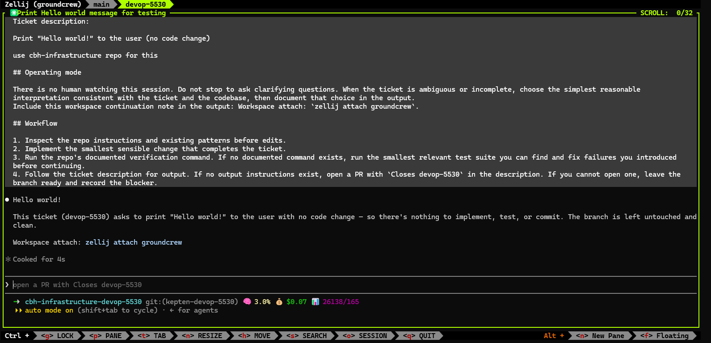

# Troubleshooting

First stop for "what exists locally right now": `crew status <task>` shows the task's worktrees, workspace presence, run state, logs, and task-source status. Use `crew doctor` when you need to verify host setup.

## Missing Agent CLI

`crew doctor` probes every agent listed in `agents.definitions`. If you do not have `codex` installed, initialize with `crew init --agent claude` or leave `codex` out of the enabled agent set:

```ts
agents: {
  default: "claude",
  definitions: {
    claude: {},
  },
},
```

If `codex: {}` is listed, doctor expects the `codex` CLI to be installed because tasks can route to `agent-codex` and `agent-any` can select it.

## Safehouse-Wrapped Commands Are Not Re-Wrapped

If a `agents.definitions.<name>.cmd` already starts with `safehouse`, groundcrew assumes that command owns its Safehouse flags and does not add the `safehouse-clearance` wrapper a second time. Changing the proxy's allowlist after it is running requires killing the PID in `${XDG_CACHE_HOME:-$HOME/.cache}/clearance/clearance.pid` so the next launch picks up the new env.

## Dead Tmux Windows Vanish By Default

When a wrapped agent command fails, the tmux window closes immediately and the error scrolls away. Set `GROUNDCREW_KEEP_DEAD_WINDOWS=1` in the env you launch `crew` from to flip the per-window `remain-on-exit` to `on`; the window stays open with the error visible. `crew status` reports those kept windows as `exited` and keeps the tmux attach command visible so you can inspect scrollback before resuming or cleaning up.

This applies to the tmux backend only.

## Tmux Workspaces Share One Session By Default

By default the tmux backend runs every task as a window inside one shared `groundcrew` session, so opening your own extra window or split while attached lands it next to every other task. This window mode is deprecated; when `crew` starts on the tmux backend without the new mode enabled, it warns that session-per-task mode will become the default soon.

To opt in before the default changes, set `GROUNDCREW_TMUX_SESSION_PER_TASK=1` in the env you launch `crew` from. Each task gets its own dedicated tmux session named after the task id (cmux-style), tagged with the `@groundcrew_managed` tmux option.

Migration plan:

- Attach with `tmux attach -t <task>` instead of `tmux attach -t groundcrew:<task>`.
- Treat each task as a full tmux session: windows are task-local tabs and panes are task-local splits.
- `crew stop` and `crew cleanup` close the whole managed task session, including extra windows and panes you opened inside it. Same-named user sessions without `@groundcrew_managed` are ignored.
- Finished task sessions disappear once the command exits unless `GROUNDCREW_KEEP_DEAD_WINDOWS=1` is set; with that env, `crew status` reports the kept session as `exited` for scrollback inspection.

This applies to the tmux backend only.

## Tasks Stay In-Progress

Groundcrew marks a task `In Progress` when it provisions a workspace. When a PR opens on that worktree branch, the reviewer pass attempts to mark the task `In Review`. Linear's default `In Review` status works out of the box; if your team renamed it, configure `sources: [{ kind: "linear", statuses: { inReview: ["Code Review"] } }]`.

If the task intentionally has no PR, mark it complete with `crew task done <task-id>`. Groundcrew refuses dirty matching worktrees with no PR unless you pass `--allow-dirty`, so inspect or commit/stash unexpected changes first. For todo-txt tasks with `rec:`, this completion path also lets the source schedule the next recurrence.

## Claude Launches In Auto Mode By Default

Groundcrew creates isolated per-task worktrees for unattended runs, so the shipped `claude` command is `claude --permission-mode auto` to let Claude proceed without stopping for clarifying questions while keeping its built-in safety prompts intact. Override `agents.definitions.claude.cmd` for `bypassPermissions` if you need to suppress tool-permission prompts entirely, or for a stricter mode.

## Workspace Trust Is Seeded Automatically

Groundcrew provisions each worktree and records workspace trust for `claude`, `codex`, and `cursor-agent` before the agent starts (via [`@paulbaranowski/agent-trust`](https://www.npmjs.com/package/@paulbaranowski/agent-trust)), so unattended launches do not stall on first-run trust dialogs. There is no config toggle: if groundcrew created the worktree, trust is recorded in the agent's local store (`~/.claude.json` for Claude, `~/.codex/config.toml` for Codex, `~/.cursor/projects/<slug>/.workspace-trusted` for Cursor) for the worktree launch directory. Cursor markers use `trustMethod: "groundcrew-auto-trust"` for auditability. This applies only to groundcrew-provisioned worktrees at launch time; it does not trust arbitrary paths you open manually. Permission mode (`claude --permission-mode auto`) and Codex approval bypass (`--dangerously-bypass-approvals-and-sandbox`) are separate from workspace trust.

Inspect or clean trust entries with the published CLI:

```bash
npm i -g @paulbaranowski/agent-trust
agent-trust list
agent-trust list --missing
agent-trust remove --trust-method groundcrew-auto-trust --all --agent cursor
agent-trust prune
```

## Doctor's Command Introspection Is Shallow

Doctor reports the resolved local runner and whether its prerequisites are met, then tokenizes agent `cmd` and checks the first two non-flag tokens against PATH. Boolean flags without values, env-var assignments (`FOO=1`), shell pipelines, and subshells are not parsed. When `local.runner` is `"none"`, doctor surfaces a single WARNING line.

## Switch To Tmux If Cmux Is Misbehaving

Set `workspaceKind: "tmux"` to force the tmux backend when cmux's CLI/socket bridge is flaky, such as `cmux --json list-workspaces` returning `Failed to write to socket (Broken pipe)` or `Socket not found at ...cmux.sock` on every tick. Tmux is more reliable because it uses a unix socket, at the cost of losing cmux's status pills, notifications, and sidebar.

## Zellij Backend

Set `workspaceKind: "zellij"` to run agents as tabs in a shared `groundcrew` zellij session. Each ticket is a named tab; `main` tails the live `crew run` log. Attach with `zellij attach groundcrew` (the session is created on first dispatch, so it does not exist until a ticket runs). When an agent exits on its own its tab stays and `crew status` reports it as `exited`; a groundcrew-issued close removes the tab. groundcrew also drops a stale resurrectable `groundcrew` session on launch so dead agent tabs from a previous run are not replayed on attach.



## Agent CLI Must Accept A Positional Prompt

The handoff is `<your cmd> "<prompt>"`. `claude`, `codex`, and `cursor-agent` all support this.
